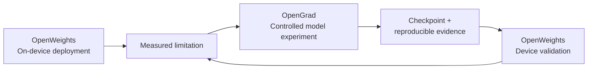
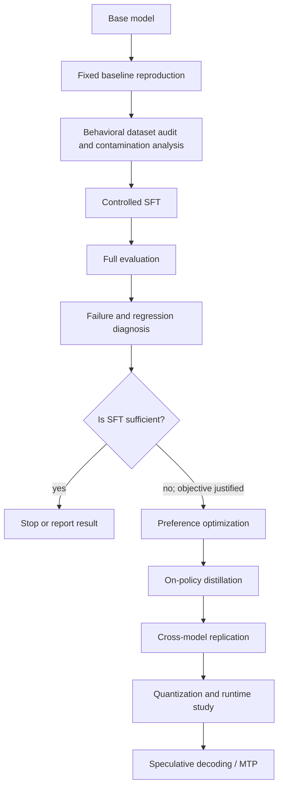
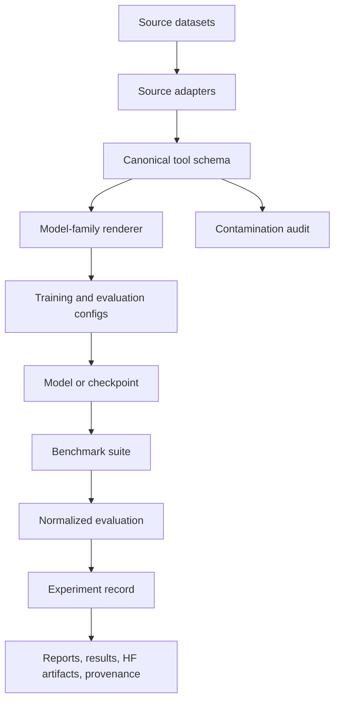

<div align="center">


# OpenGrad

**Every gradient is a hypothesis. Every checkpoint is evidence.**

Open empirical research on capability–efficiency tradeoffs in small open-weight language models.

[](https://github.com/arrogance231/OpenGrad/actions/workflows/ci.yml)
[](pyproject.toml)
[](LICENSE)
[](PRE_EXPERIMENT_REPORT.md)

</div>

OpenGrad studies how much capability can be extracted from small open-weight language models through controlled post-training, and how much inference efficiency can subsequently be gained without unacceptable capability regression.

Model changes are hypotheses, not improvements. Every intervention is measured. Every regression matters. Failed experiments remain part of the record, and every reported result must be reproducible.

> **Current state:** the repository has validated CPU-safe research infrastructure, registries, schemas, fixtures, adapters, mock evaluation harnesses, and future experiment protocols. It has **no trained OpenGrad model, model inference run, real benchmark score, inference benchmark, speculative-decoding experiment, or published empirical result**. See the [Phase 0.5 report](PRE_EXPERIMENT_REPORT.md).

## At a glance

| Question | Current answer |
| --- | --- |
| What is being studied? | Capability–efficiency tradeoffs in small open-weight models. |
| What is the first study? | Reliable tool use, beginning with a planned Qwen3.5-2B baseline. |
| What happens after the baseline? | Controlled SFT, diagnosis, conditional preference optimization, distillation, replication, and later systems studies. |
| How is improvement judged? | Capability, regression, reliability, efficiency, cost, and reproducibility—not one headline score. |
| Are failures publishable? | Yes. Failed, null, rejected, and non-reproducible runs are evidence. |
| Are results available now? | No empirical OpenGrad result exists yet. |

## Why OpenGrad?

Small open-weight models can run locally, reduce inference cost and latency, operate on constrained hardware, and make direct model research more reproducible. They also make tradeoffs impossible to ignore:

```text
tool accuracy       ↑    general instruction following ↓
throughput          ↑    quality                       ↓
quantized size      ↓    reasoning/tool reliability   ↓
specialization      ↑    out-of-domain capability      ↓
```

A recipe is not better merely because one metric increases. OpenGrad evaluates whether an intervention improves the intended behavior while preserving general capability, reliability, efficiency, cost, and reproducibility.

## From deployment problems to research questions

OpenGrad did not choose tool calling and inference efficiency arbitrarily. Its initial questions were motivated by practical deployment findings from [OpenWeights](https://github.com/alpharomercoma/openweights), an independent open-source Android project developed by `alpharomercoma`. OpenWeights runs open-weight Hugging Face models locally on constrained consumer hardware, primarily through llama.cpp/GGUF, with an additional ExecuTorch runtime.

OpenWeights exposed two problems that conventional model capability claims can hide:

- **Tool support is not reliable tool-use policy.** A model can emit valid call syntax and still under-call when external information is needed, over-call for facts it should answer directly, select based on tool ordering, fail to ask for missing information, or behave differently across model families.
- **Model fit is not interactive efficiency.** Large system prompts, tool definitions, conversation history, observations, multiple inference passes, KV-cache behavior, CPU/GPU choice, memory pressure, and thermal state all affect whether an agent is useful on a phone.

These are observations from OpenWeights, not OpenGrad results. OpenGrad turns them into controlled questions about the weights, then plans to return validated checkpoints to constrained downstream evaluation. The detailed provenance and scoped measurements are in [From deployment problems to research questions](docs/research/motivation.md).



This is the intended feedback loop. The repositories are independently maintained: OpenGrad does not own OpenWeights, and OpenWeights is not an OpenGrad subproject.

## Research questions

OpenGrad's program asks:

### RQ1 — Reliable tool policy

Can controlled post-training improve when and how small models use tools, beyond the tool syntax already present in their instruct checkpoints?

### RQ2 — Transfer

Do those improvements transfer from controlled evaluations into realistic agent runtimes and workload patterns such as those exposed by OpenWeights?

### RQ3 — Regression

What ordinary instruction-following, reasoning, calibration, latency, or robustness capabilities regress as tool reliability improves?

### RQ4 — Distillation

When SFT reaches its ceiling, can on-policy distillation from a larger model improve the remaining decision-boundary failures?

### RQ5 — Constrained inference

Can target-attached/native speculative decoding improve small-model decode efficiency without the memory and runtime cost of maintaining a separate draft model?

### RQ6 — Capability × efficiency

Do post-training gains survive quantization and optimized constrained-device inference?

## Study 001 — Reliable Tool Use in Small Language Models

The first planned track asks whether a small open-weight model can reliably decide **when and how** to use tools while retaining ordinary instruction-following capability. It is not an attempt to add tool-call grammar to a model that cannot serialize calls. It targets the decision boundary: `CALL`, `DO NOT CALL`, `ASK FIRST`, `SELECT`, `GROUND ARGUMENTS`, `CHAIN`, `PARALLELIZE`, `RECOVER`, and `STOP`.

The study will cover, when the corresponding evaluation is implemented:

- deciding whether to call a tool, answer directly, ask for clarification, or reject an unsupported request;
- selecting the correct tool and producing schema-valid, grounded arguments;
- parallel tool calls and sequential tool dependencies;
- consuming tool observations and handling tool failure;
- maintaining state across multi-turn tasks.

The first baseline is [`Qwen/Qwen3.5-2B`](registry/models.yaml), recorded as `qwen3.5-2b` at an immutable revision in the [experiment definition](configs/experiments/tool_calling/qwen35_2b_baseline.yaml). It is **READY / NOT RUN**. No model has been downloaded, loaded, trained, or evaluated by OpenGrad.

## Experimental decision pipeline

The roadmap is a decision process, not a mandatory recipe. Preference optimization is used only if diagnosis identifies a failure that such an objective is appropriate to address. Later stages require evidence from earlier stages.



## Current research status

Pre-GPU preparation: COMPLETE / BASELINE_INFERENCE_READY. The first empirical action is B0 baseline inference; no model result exists yet.

| Stage | Status | Evidence |
| --- | --- | --- |
| Repository and research infrastructure | VALIDATED | [Bootstrap report](BOOTSTRAP_REPORT.md) |
| CPU fixture and preflight validation | VALIDATED | [Phase 0.5 report](PRE_EXPERIMENT_REPORT.md) |
| Qwen3.5-2B baseline reproduction | READY / NOT RUN | [Baseline record](configs/experiments/tool_calling/qwen35_2b_baseline.yaml) |
| Dataset materialization and audit | COMPLETE for current accessible pinned corpora; BUTTON and xLAM included | [Normalization report](reports/data-normalization-v1.md) |
| Tool-use SFT | NOT STARTED | [Roadmap](ROADMAP.md) |
| Preference optimization | CONDITIONAL | Only if full evaluation justifies it |
| On-policy distillation | PLANNED | [Roadmap](ROADMAP.md) |
| Cross-model replication | PLANNED | [Roadmap](ROADMAP.md) |
| Quantization and runtime evaluation | PLANNED | [Efficiency notes](docs/inference/efficiency.md) |
| Speculative decoding / MTP | PLANNED | [Reserved configuration](configs/inference/speculative/README.md) |

`VALIDATED` here means repository or fixture infrastructure passed its checks. It does not mean an ML model or real benchmark was validated. The status vocabulary used by experiment records is defined by the [experiment schema](registry/experiments.schema.json).

## Dataset releases

OpenGrad publishes large normalized research artifacts on Hugging Face while GitHub remains the canonical home for normalization code, schemas, manifests, audits, provenance, and experiment definitions. The prepared release is [`arrochi112/OpenGrad-ToolPolicy-Canonical-v1`](https://huggingface.co/datasets/arrochi112/OpenGrad-ToolPolicy-Canonical-v1) and is now publicly published and verified at Hub commit `4d2bf3ab1cd480f04c13627c153a4cf9cf4e145f`. It is a model-independent pre-training canonical candidate corpus, not a recommended mixture, Qwen-rendered training data, M0, M1, M2, or a model result. The release excludes xLAM pending gated redistribution review.

The release excludes the frozen evaluation set, When2Call preference data, and Qwen-rendered text. xLAM is materialized locally but remains excluded from the default publication build pending review of its gated redistribution terms.

The dataset registry records source identity, revisions, intended stages, split restrictions, contamination risk, and processing state. All currently accessible pinned corpora have now been materialized or normalized through bounded, resumable canonical artifacts; BUTTON has been normalized with 59 duplicate-tool failures quarantined. OpenGrad preserves two axes: where an example came from (source provenance) and what it trains (behavioral capability). Datasets are sources of evidence, not capabilities by themselves.

| Dataset | Purpose in the program | Current support | Training eligibility | Provenance |
| --- | --- | --- | --- | --- |
| [xLAM / APIGen Function Calling 60k](registry/datasets.yaml) | Function selection and argument generation | FULL_DATA_VALIDATED: 59,370 retained; 259 failures; 371 duplicates | Future SFT; `train` | Salesforce snapshot revision recorded in registry |
| [When2Call](registry/datasets.yaml) | Call/no-call decisions and answer quality | FULL_DATA_VALIDATED for accessible SFT/preference/evaluation splits | SFT, preference, evaluation remain separate | NVIDIA HF and GitHub sources recorded |
| [ToolACE](registry/datasets.yaml) | Complex schemas, candidate tools, parallel/dependent calls, negatives | FULL_DATA_VALIDATED with quarantined malformed rows | Future SFT | Team-ACE source revision recorded |
| [BUTTON / BUTTONInstruct](registry/datasets.yaml) | Multi-turn compositional trajectories | FULL_DATA_VALIDATED: 7,941 retained; 59 duplicate-tool failures quarantined; rendering and audits complete | Future SFT | Repository commit recorded |
| [LoopTool-23k](registry/datasets.yaml) | Loop/tool trajectories requiring lineage audit | FULL_DATA_VALIDATED with quarantined malformed rows | Future SFT | Source revision recorded; possible derivation overlap |
| [Glaive Function Calling v2](registry/datasets.yaml) | Additional function-calling coverage | FULL_DATA_VALIDATED | Future SFT | HF snapshot revision recorded |

These states are deliberately different:

```text
adapter implemented ≠ fixture validated ≠ metadata validated
metadata validated ≠ full dataset materialized ≠ used in an experiment
```

The historical [`tool-calling-mixture-v1`](configs/data/tool_calling/mixture_v1.yaml) is retained as M0, a source-oriented control hypothesis. M1 is the behaviorally balanced [`balanced_policy_v1`](configs/data/tool_calling/balanced_policy_v1.yaml); M2 is the baseline-dependent, schema-ready [`residual_policy_v1`](configs/data/tool_calling/residual_policy_v1.yaml). No mixture has been trained. See the [tool-use mixture methodology](docs/data/tool-use-mixture-methodology.md) and [behavior matrix](docs/data/training-behavior-matrix.md). Materialization preserves source metadata and terms, verifies checksums, normalizes, labels, deduplicates, audits overlap, and freezes versioned artifacts ([protocol](docs/data/DATASET_MATERIALIZATION_PROTOCOL.md)).

`Salesforce/APIGen-MT-5k` is explicitly excluded from the clean default because of possible τ-bench/τ² overlap. If it is ever used, it must use the contaminated namespace and its scores cannot be presented as clean generalization ([contamination configuration](configs/data/tool_calling/contamination.yaml)).

## Benchmark program

OpenGrad has deterministic mock smoke harnesses for the following configured evaluation families. A smoke harness validates the local result contract with fixture predictions; it is not a real model evaluation.

| Benchmark | Measures in the registry | Harness status | Real score available? | Revision state |
| --- | --- | --- | --- | --- |
| BFCL V4 | Function-call accuracy | Mock smoke harness | **No** | Recommended Gorilla revision pinned |
| When2Call | Call decision, answer quality | Mock smoke harness | **No** | Evaluator revision unresolved |
| τ-bench / τ² | Task success, reward | Mock smoke harness | **No** | Recommended repository revision pinned |
| ToolSandbox | Tool-use correctness | Mock smoke harness | **No** | Authoritative metadata pending |
| MCPMark Verified | Task success | Mock smoke harness | **No** | Stretch evaluation; metadata pending |
| Toolathlon | Task success | Mock smoke harness | **No** | Stretch evaluation; metadata pending |

The full benchmark registry is [`registry/benchmarks.yaml`](registry/benchmarks.yaml). The current checkout reports `BOOTSTRAP_NO_SCORES`; **no real OpenGrad benchmark score exists**.

Benchmarks are measurements, not the product requirement. The intended evaluation stack is: deterministic behavior and regression checks; established external tool-use benchmarks; and downstream agent/runtime evaluation under realistic constrained-device conditions. The third layer is planned, not implemented. A benchmark gain that becomes worse in an OpenWeights-style workload is not an unqualified success.

## Measurement, not leaderboard chasing

### Tool-use capability

The canonical schema and evaluation contracts support measurement of tool-call structure and behavior, including:

- call/no-call/clarification/impossible-tool decisions;
- tool selection and schema-valid arguments;
- argument correctness and grounding;
- parallel calls, sequential dependencies, and tool observations;
- tool-failure handling and multi-turn state;
- ordinary instruction-following and structured-output regression.

The repository currently provides contracts and fixtures for these behaviors, not empirical model scores.

### Systems efficiency — planned

Future runtime studies may measure time to first token, prefill and decode throughput, end-to-end latency, VRAM/RAM, checkpoint size, quantization effects, speculative acceptance and accepted length, drafted/accepted tokens per step, draft/target verification cost, total model footprint, added parameters, KV-cache use, load time, output equivalence, parser/EOS/tool failures, and energy or thermal behavior where reliable instrumentation exists. The [efficiency notes](docs/inference/efficiency.md) keep this axis separate from behavioral correctness.

OpenGrad uses **target-attached/native speculative decoding** to mean a speculative mechanism trained into or closely attached to the target model, such as an MTP or Medusa-style head, an architecture-permitted EAGLE-like method, a self-speculative method, or another attached mechanism. It does not mean that external draft-model speculation is inherently bad, and no approach is presumed faster. Where feasible, the comparison is ordinary autoregressive decoding versus external draft-model speculation versus target-attached/native speculation.

An efficiency gain is not automatically desirable if capability or reliability falls substantially.

## Capability × efficiency

OpenGrad has two related but distinct directions:

| Capability | Efficiency |
| --- | --- |
| SFT; preference optimization when justified; distillation; tool use; specialization; robustness | Quantization; speculative decoding; draft/target decoding; native MTP; architecture-aware decoding; device deployment |

```text
             Capability
                 ↑
                 │       desirable region
                 │            ●
                 │
                 └────────────────────→ Efficiency
```

## Research architecture

The repository separates declarative identity from semantics, model boundaries, and evidence:



- `registry/` — dataset, benchmark, model, runtime, hardware, provenance, and experiment contracts.
- `src/opengrad/` — canonical data, fixture adapters, parsing, contamination tools, evaluation schemas, lineage, stage gates, and reporting utilities.
- `configs/` — data, evaluation, model, training, inference, and planned experiment configurations.
- `experiments/`, `reports/`, `results/` — append-only namespaces for future evidence; no completed result is present.
- `docs/` — methodology, architecture, data, benchmark, inference, reproducibility, contribution, and publication protocols.
- `release/` — tracked Hugging Face release definitions, dataset-card template, attribution audit, and citations.
- `hf/` — model-card, dataset-card, and experiment-report templates.

Training and inference implementations are intentionally not executed in the current pre-GPU phase. Large data and checkpoints remain outside Git and must be referenced by immutable revisions and hashes.

## Reproducibility and provenance

An OpenGrad result should preserve, where applicable:

- base model and exact model revision;
- tokenizer revision and chat/parser configuration;
- dataset repository, revision, split, preprocessing configuration, and hash;
- benchmark repository, split, evaluator version, and revision;
- seed, hyperparameters, training and runtime software;
- hardware, driver, accelerator runtime, and compute provider;
- checkpoint lineage, quantization, inference settings, and generated artifacts;
- known regressions, failures, uncertainty, and limitations.

Unavailable fields remain `null` or `UNKNOWN`; they are never inferred. **An untraceable score is not an OpenGrad result.** See [reproducibility](docs/research/reproducibility.md), the [experiment schema](registry/experiments.schema.json), and the [provenance schema](registry/provenance.schema.json).

## Negative results are results

OpenGrad retains successful runs, failed runs, regressions, null results, non-reproductions, and rejected hypotheses. This prevents duplicated failed work, exposes unstable recipes and model-family differences, makes sensitivity visible, and reduces cherry-picking. A lower score can be useful evidence if the comparison and failure analysis are reproducible.

## Provenance across projects

OpenGrad uses explicit labels when referring to the neighboring deployment project:

```text
Observed in OpenWeights
Motivated by OpenWeights
OpenGrad hypothesis
OpenGrad planned experiment
OpenGrad reproduced
OpenGrad result
```

`Observed in OpenWeights` is not `OpenGrad result`. OpenGrad must independently execute and record any claimed reproduction. See the [motivation and provenance note](docs/research/motivation.md) for direct links to the OpenWeights tool-calling, first-turn latency, inference-engine, and speculative-decoding records.

## Results

> **No empirical OpenGrad result has been published yet.**

The stable results namespace is ready for future records. The empty table is intentional.

| Experiment | Model | Change | Capability Δ | Regression | Efficiency Δ | Reproduced | Report |
| --- | --- | --- | --- | --- | --- | --- | --- |

`results/registry.jsonl` is currently empty. Do not confuse the 63 passing CPU tests reported by the pre-GPU validation with ML evidence: they validate infrastructure and fixtures, not model quality.

### Illustrative future record

This is a schema-shaped example only; it is not a run and contains no result:

```yaml
experiment_id: example-only
status: EXAMPLE

model:
  family: qwen
  revision: <immutable revision>

intervention:
  type: sft

data:
  mixture: <versioned config>

evaluation:
  benchmark_revision: <commit>

environment:
  hardware: <captured>
  software: <captured>

results:
  capability: <not-run>
  regressions: <not-run>
  efficiency: <not-run>
```

Use the real [experiment schema](registry/experiments.schema.json) and [experiment report template](hf/EXPERIMENT_REPORT_TEMPLATE.md) for actual records.

## Development setup

Requirements: Python 3.11+ and [uv](https://docs.astral.sh/uv/).

```bash
uv sync --extra dev
uv run opengrad-validate
uv run opengrad-preflight
uv run pytest
```

These commands validate registries, capture the local environment, exercise CPU-safe fixtures, and run the test suite. They do not download models or datasets, run inference, train a model, or produce a benchmark score. The current preflight explicitly reports `GPU experiments: NOT STARTED`.

## Reproducing experiments

There is no completed experiment to reproduce yet. The future baseline workflow is specified in [`BASELINE_REPRODUCTION_PROTOCOL.md`](docs/experiments/BASELINE_REPRODUCTION_PROTOCOL.md): acquire the accelerator, fetch the exact Qwen3.5-2B revision, validate its native template/parser, run sanity checks, execute the selected baseline evaluations, compare revisions and settings, investigate discrepancies, and pass the reproduction gate. That protocol is not executed by the development commands above.

## Navigation

| I want to… | Start here |
| --- | --- |
| Understand the methodology | [Research methodology](docs/research/methodology.md) |
| Reproduce an experiment | [Baseline protocol](docs/experiments/BASELINE_REPRODUCTION_PROTOCOL.md) |
| Inspect datasets | [Dataset registry](registry/datasets.yaml) and [data protocols](docs/data/) |
| Inspect benchmarks | [Benchmark registry](registry/benchmarks.yaml) and [benchmark notes](docs/benchmarks/README.md) |
| Inspect model-family boundaries | [Model configs](configs/models/) and [model registry](registry/models.yaml) |
| See experiment records | [experiments/](experiments/README.md) |
| See results | [results/](results/registry.jsonl) |
| See reports and failures | [reports/](reports/README.md) |
| Add or challenge a finding | [CONTRIBUTING.md](CONTRIBUTING.md) and [contribution protocols](docs/contributing/README.md) |
| Cite OpenGrad | [CITATION.cff](CITATION.cff) |

## Multi-model design

OpenGrad is not a Qwen repository. Qwen3.5-2B is the first planned target, not the permanent scope. Configuration namespaces reserve future work for Qwen, Gemma, Llama, Phi, SmolLM, and LFM, but those namespaces currently contain no implemented model adapters or results. The distinction matters:

```text
implemented infrastructure ≠ planned model ≠ working adapter ≠ replicated result
```

## How to challenge a result

You do not need to agree with a result to contribute. Showing that it fails to reproduce is valuable research. Useful challenges include:

- reproduce a finding with another seed or model family;
- reproduce it on another GPU or consumer device;
- challenge a dataset assumption or identify contamination;
- identify evaluator disagreement or compare inference implementations;
- submit a failed reproduction or negative result.

Start with [CONTRIBUTING.md](CONTRIBUTING.md), the [reproduction PR guide](docs/contributing/reproduction-pr.md), and the [negative-result guide](docs/contributing/negative-result.md). Do not commit checkpoints, bulk datasets, credentials, or fabricated results.

## Related projects

- [OpenWeights](https://github.com/alpharomercoma/openweights) — downstream execution environment for compatible GGUF/llama.cpp and ExecuTorch artifacts and practical device-side measurements. OpenGrad defines experiments, evaluation, and evidence; OpenWeights runs compatible artifacts.
- [OpenPapers](https://github.com/arrogance231/openpapers) — optional literature discovery and scholarly provenance support. Its findings are research inputs, not empirical OpenGrad results; see [the boundary documentation](docs/research/OPENPAPERS.md).

OpenGrad's initial research questions were motivated in part by engineering and measurements from OpenWeights, developed by `alpharomercoma`. OpenWeights provides the constrained-device environment in which practical limits of small open-weight models became visible; it remains an independent project rather than an OpenGrad component.

## Roadmap

The program proceeds from infrastructure to controlled measurement: [repository infrastructure](ROADMAP.md), baseline reproduction, dataset preparation and audit, controlled SFT, diagnosis, conditional preference optimization, distillation, cross-model replication, quantization/runtime studies, OpenWeights device studies, speculative decoding/MTP, and joint capability–efficiency research. A later phase is not successful without reproducible evidence and regression analysis.

## Citation and license

Please cite the repository using [CITATION.cff](CITATION.cff) until a formal release DOI exists. OpenGrad source code and documentation are licensed under [Apache-2.0](LICENSE). Third-party datasets, models, benchmark assets, papers, and imported code retain their own terms.

## Acknowledgements

OpenGrad records upstream datasets, models, benchmarks, and papers in its registries and documentation. Those sources remain subject to their own licenses and attribution requirements.
