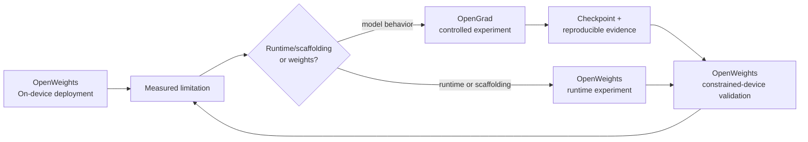

# From deployment problems to research questions

OpenGrad's initial research questions were motivated by practical deployment findings from [OpenWeights](https://github.com/alpharomercoma/openweights), an independent open-source Android application developed by `alpharomercoma`. OpenWeights runs open-weight Hugging Face models locally on constrained consumer hardware, primarily through llama.cpp/GGUF, with an additional ExecuTorch runtime.

OpenWeights and OpenGrad are independently maintained projects. OpenGrad does not own OpenWeights, and OpenWeights is not an OpenGrad subproject. OpenWeights is a problem-discovery and downstream-validation environment; OpenGrad designs and records controlled model experiments.

## What deployment exposed

OpenWeights' engineering and measurement record exposed two recurring distinctions:

1. Tool-call syntax is not reliable tool-use policy.
2. A model that fits on a device is not necessarily fast enough for interactive agent use.

The first distinction is behavioral. A model can emit a valid call-shaped object and still under-call when external information is required, over-call for facts it should answer directly, select a tool based on catalogue ordering, fail to ask for missing information, or behave differently under the same instructions across model families. A tool-capable template also does not establish that the weights make good decisions.

The second distinction is systems-level. An agent turn may contain a large system prompt, tool definitions, conversation history, tool observations, and multiple inference passes. On a phone, prompt processing, decode speed, KV-cache reuse, memory pressure, CPU/GPU choice, load time, and thermal state all affect whether a behavior is useful in practice.

These are observations from OpenWeights, not OpenGrad results.

## Scoped observations from OpenWeights

The linked documents are the source of the following claims and their scope:

- In the [tool-calling record](https://github.com/alpharomercoma/openweights/blob/main/docs/research/tool-calling.md), model families behaved differently under the same tested harness: Qwen 2.5 1.5B under-called, Gemma 3 1B over-called on one prompted route, and LFM2 1.2B also under-called. Tool ordering changed decisions for some models, while the tested warm-cache comparison did not. The record also documents that a template can advertise tool support while failing to render tool definitions or tool results correctly.
- In the same record, a six-model, six-case routing matrix found that the tested models did not share one failure mode. The result was not a universal prompt recipe; it was evidence that routing behavior is model-dependent and that a global system prompt cannot be assumed to solve it.
- In the [first-turn latency record](https://github.com/alpharomercoma/openweights/blob/main/docs/research/first-turn-latency.md), one measured agent prompt contained 2,054 tokens, with roughly 1,700 tokens attributable to tool definitions and call-format teaching. Prefix warming and state reuse reduced measured first-turn work in the documented device/model conditions. These are deployment measurements, not an OpenGrad latency result.
- In the [inference-engine record](https://github.com/alpharomercoma/openweights/blob/main/docs/research/inference-engines.md), prefill, decode, CPU/GPU behavior, KV reuse, and model-family cache behavior varied materially with device and workload. The document records why llama.cpp/GGUF is the primary arbitrary-model path and why ExecuTorch remains a separate compiled-artifact boundary.
- In the [speculative-decoding record](https://github.com/alpharomercoma/openweights/blob/main/docs/research/speculative-decoding.md), one phone measurement found that a separate DSpark draft was slower than plain decoding for the tested 1.2B target and settings. This does **not** establish that draft-model speculation is generally ineffective. It motivates measuring total resource tradeoffs and target-attached alternatives under constrained conditions.

The provenance labels are intentional:

```text
Observed in OpenWeights
Motivated by OpenWeights
OpenGrad hypothesis
OpenGrad planned experiment
OpenGrad reproduced
OpenGrad result
```

`Observed in OpenWeights` is not `OpenGrad result`. OpenGrad must independently execute and record any claimed reproduction.

## The research boundary

OpenWeights can address runtime and scaffolding limitations through better prompting, tool availability filtering, ordering, parsing, KV reuse, context management, CPU/GPU selection, and thermal policy. Those interventions are valuable, but some behavior may originate in the model weights. OpenGrad begins where a controlled model-level experiment is justified.



This is the intended research loop, not a claim that the complete loop is implemented today.

## Why tool policy is the first capability question

The question is not whether a model can syntactically emit a tool call. Modern small instruct models may already advertise function-calling support. Syntax is analogous to JSON syntax: necessary for execution, but not evidence of reliable behavior.

OpenGrad asks whether controlled post-training can improve the policy boundary:

```text
CALL · DO NOT CALL · ASK FIRST · SELECT · GROUND ARGUMENTS
CHAIN · PARALLELIZE · RECOVER · STOP
```

The first study therefore targets reliable tool-use policy under realistic agentic workloads, rather than training a grammar into a model that lacks one. It must test both specialization and regressions, and eventually transfer from deterministic checks and external benchmarks into downstream runtime workloads such as those exposed by OpenWeights.

## Why target-attached speculation is a second question

Conventional draft-model speculative decoding is a useful and established technique. The constrained-device question is narrower: if a target model was selected because memory and compute are scarce, maintaining and executing a second independently deployed model may consume part of the resource budget that the optimization is intended to save.

OpenGrad therefore treats the following as a hypothesis, not a conclusion:

> A target-attached speculative mechanism may offer a better total memory/compute/latency tradeoff than maintaining a separate draft model for some small-model deployments.

The planned comparison is, where technically feasible:

```text
ordinary autoregressive decoding
vs. external draft-model speculation
vs. target-attached/native speculation
```

Target-attached/native is an experimental category, not a synonym for every speculative method. Candidate mechanisms may include MTP heads, Medusa-style heads, EAGLE-like approaches where the architecture permits, self-speculative methods, and other attached mechanisms. Each requires its own architecture and correctness analysis.

The eventual measurements must include decode throughput, TTFT, time to final answer, acceptance and accepted length, verification overhead, RAM/VRAM, total model footprint, added parameters, KV-cache use, load time, quality/tool-call equivalence, and reliable power or thermal measurements where available. Any of the three outcomes—native wins, external draft wins, or ordinary decoding wins—is valid evidence.

## Three evaluation layers

OpenGrad must not optimize only for a benchmark score. Its intended evaluation progression is:

1. **Deterministic behavior and unit evaluations** — contracts, parser behavior, routing decisions, and controlled regression checks.
2. **Established external benchmarks** — BFCL, When2Call, τ-bench/τ², ToolSandbox, MCPMark, Toolathlon, and other selected evaluators with exact revisions.
3. **Downstream agent/runtime evaluation** — realistic workloads and constrained-device conditions, including OpenWeights-style prompt, tool-loop, latency, memory, and thermal behavior where an integration is actually implemented.

A benchmark gain that does not transfer to the downstream workload is not an unqualified success. Conversely, a deployment failure can identify a model-level question even when a leaderboard score looks acceptable.
